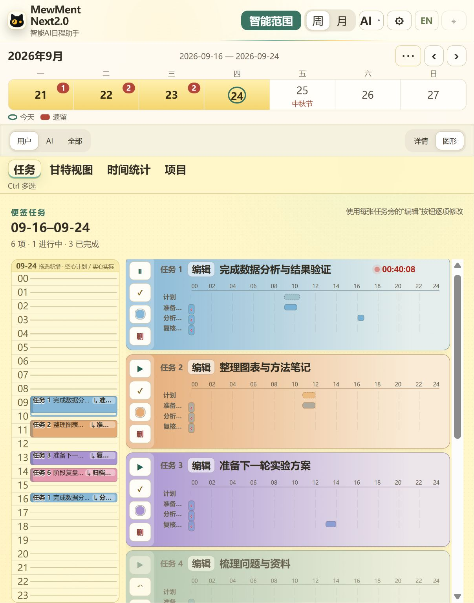
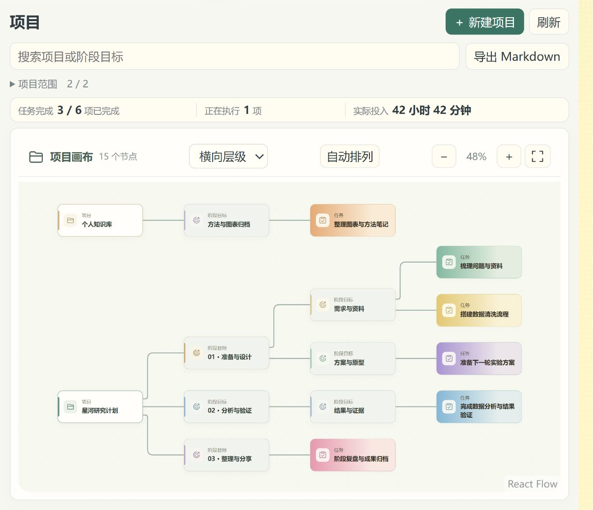
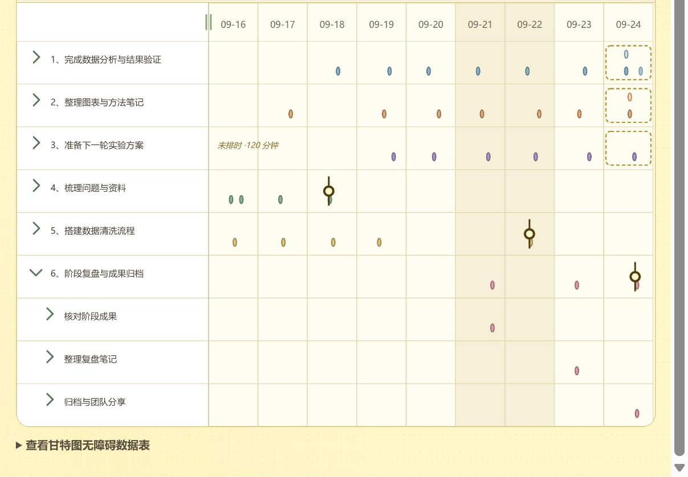
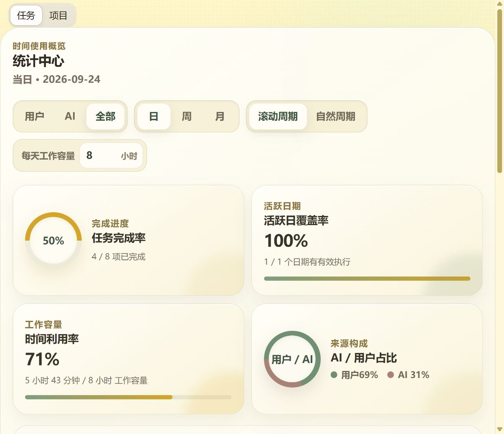

  
  <h1>MewMent</h1>
  
<strong>Your plans, actual work and AI collaboration, on one timeline.</strong>

  
A free Windows desktop planner, time tracker and AI session organizer.

  
<a href="https://github.com/MrDeeCards/MewMent/releases">Download</a> · <a href="https://mewment.vercel.app">Website</a> · <a href="https://github.com/MrDeeCards/MewMent/issues">Report an issue</a> · <a href="README.md">中文</a>

  
Windows 10 / 11 · x64 · Chinese / English · Free after registration and sign-in

## Work has more than a to-do list

Plans change, work is interrupted, files live in different folders, and conversations with AI stay in different tools. MewMent connects these pieces: plan a task, track the work, describe the outcome, attach useful files, and review the result in a project, Gantt chart or time report.

## Features

| Area | What you can do |
| --- | --- |
| Tasks | Create undated tasks, subtasks, plans and countdowns; choose dates or an intelligent pending range |
| Actual work | Start / pause timers, record multiple work intervals, backfill time and map intervals to subtasks |
| Projects | Organize projects, milestones and tasks; edit a graph; import Markdown outlines with tasks that activate when needed |
| Reports | Compare planned and actual work in Gantt views, review time statistics and export natural-period charts |
| Files | Attach files to tasks, keep readable directories and export a project-based attachment tree |
| AI history | Discover supported local agent sessions, summarize them and retain their source paths, including Windows / WSL sources |
| AI assistant | Use your own model service to manage tasks, work intervals and projects, with a user-selected file workspace |
| MCP | Let external agents work with your schedule through revocable, account-bound access keys |
| Desktop | Use the sidebar, floating timer, mini chat, themes, country calendars and cat companions |

| Projects | Gantt | Statistics |
| :---: | :---: | :---: |
|  |  |  |

The website includes interactive demonstrations using synthetic data. Screenshots illustrate features; appearance may change between releases.

## Install

Current release: **0.10.8-dev.70 — Windows x64 preview**.

1. Download `MewMent-0.10.8-dev.70-windows-x64-setup.exe` from [Releases](https://github.com/MrDeeCards/MewMent/releases).
2. Run the per-user installer. Microsoft Edge WebView2 is required; installation is offered if it is missing.
3. Register and sign in. There is no trial countdown, activation code or software subscription.
4. Create a task and try the timer. AI setup is optional; consult the [API setup guide](website/Resource/Guides/API-setup.en.md) when ready.

A ZIP package and `SHA256SUMS.txt` are also available. Extract the entire ZIP, keep the programs together and run `edgecalendar-public-preview.exe`. Back up application data before upgrading.

This preview installer is **not code-signed**, so Windows may show an unknown-publisher warning. Verify the download source and checksum. No macOS, Linux or Windows ARM64 installer is provided here.

## Free software and data boundaries

MewMent is free to use after sign-in. Your chosen AI provider may charge for model usage. The account service synchronizes only approved interface preferences, such as language, theme, fonts, layout and calendar display. It does not synchronize task or project content, attachments, conversation bodies, API configuration, API keys or local paths.

API keys stay in the local operating-system credential store. Requests to an AI service send the content needed for that request to your chosen provider. File operations by the assistant are limited to the workspace you select; sensitive application actions retain their confirmation flows.

Read the [draft terms](website/Resource/Legal/terms.en.md) and [draft privacy notice](website/Resource/Legal/privacy.en.md).

## Repository

This is the public **downloads and website repository**, not the complete desktop application source repository. Installers live in Releases. Website code, synthetic browser demonstrations, setup guides and resource notices live under `website/`; Vercel serves that directory. Free use does not imply a commitment to publish the entire application source. Third-party resources retain their own licenses; see [notices](THIRD_PARTY_NOTICES.md).

For a local website preview, run `python -m http.server 8080 --directory website` from the repository root and open `http://localhost:8080`. The website demo does not connect to your desktop data or accept real API keys.

## Contact

Use [Issues](https://github.com/MrDeeCards/MewMent/issues) for reproducible problems and suggestions. Include the app version, Windows version, steps and redacted screenshots. Never upload passwords, API keys, private databases or private conversations.

- Email: **thehomeofsea@gmail.com**
- WeChat public account: **Mr.DeeCards**
- Reddit display name: **Dr.DeeCards**
